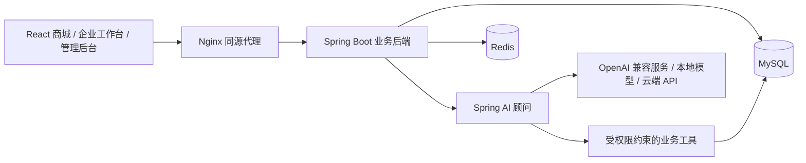

<div align="center">


**让大宗采购更直接，让 AI 回答有据可查。**

一个连接现货商城、库存与交易业务的 AI 顾问学习项目。


[快速启动](#快速启动) · [模型配置](#模型配置) · [项目架构](#项目架构) · [文档导航](#文档导航) · [问题反馈](https://github.com/YiGalaxy/spotlink/issues)

</div>


## 为什么做 SpotLink

大宗采购需要同时看商品、库存、行情和交易规则。SpotLink 把这些业务放在一个具体场景中：用户先逛商城，再问顾问“我还有多少可用库存？”或“这笔订单下一步要做什么？”，模型通过有权限的业务工具查数，回答可以展开查看调用依据。

这也是一个 AI 工程学习项目：用业务约束学习 Spring AI、工具调用、会话记忆和 RAG，后续加入独立 LangChain 引擎与效果评测。项目处于持续建设阶段，完整路线见[实施计划](docs/SpotLink实施计划-2026-10-08.md)。

## 目前能体验什么

| 体验 | 当前能力 |
| --- | --- |
| 现货商城 | 搜索、品类筛选、真实挂牌浏览与详情；六种商品的独立 AI 图片 |
| 企业库存 | 库存登记、规格校验、可用与冻结数量、精确汇总；按企业隔离 |
| 登录与工作台 | 账号登录、企业身份、待办入口；首页默认进入商城 |
| AI 顾问 | 查货比价、余量/仓库/交付、运费参数估算、商品卡片跳转、可编辑采购需求与隔离会话 |
| 平台模型管理 | 管理员调整 API 地址、模型、密钥、输出上限和超时；保存对下一轮立即生效 |

交易、合同、行情和知识库已有接口与页面代码，完整业务验收仍按计划推进。**独立 LangChain 引擎、用户个人模型配置、完整双引擎评测尚待实现。** 模型接入成功也不代表所有业务节点已验收。

## 快速启动

宿主机只需 **Git、Docker Desktop（Linux 容器）、Docker Compose v2 和 Windows PowerShell**。Java、Node.js、数据库和浏览器验收均在 Docker 中运行。

打开 PowerShell，克隆仓库并启动：

```powershell
git clone https://github.com/YiGalaxy/spotlink.git
cd spotlink
.\start.cmd -Build -NoPause
```

首次启动会生成被 Git 忽略的 `.env`，随机配置 MySQL、Redis、JWT 和后台模型凭证加密密钥，构建镜像并等待服务健康。重复启动保留配置和数据卷。

首次初始化也可运行 `.\setup-demo.cmd -NoPause`；`start.cmd` 共用最小数据生成、业务/知识导入和验证流程。独立入口为 `import-data.cmd`、`data-status.cmd`，各步骤及失败恢复见[数据初始化](docs/数据初始化.md)。当前包为 minimal，完整 demo 仍按计划扩展。

导入后的库存查询、多轮会话和规则引用可用 `check.cmd -Task C16 -Mode ai-offline -Engine spring-ai -NoPause` 在独立环境复现，包含 10 条基线和桌面/手机页面检查。模型为固定替身，真实接口与工具取数使用隔离数据库，详见[早期顾问基线](evals/README.md)。

| 入口 | 地址 |
| --- | --- |
| 现货商城 | [http://127.0.0.1:18080](http://127.0.0.1:18080) |
| AI 顾问 | [http://127.0.0.1:18080/advisor](http://127.0.0.1:18080/advisor) |
| 平台运营后台 | [http://127.0.0.1:18080/admin](http://127.0.0.1:18080/admin) |
| 管理后台 · 模型配置 | [http://127.0.0.1:18080/admin/model](http://127.0.0.1:18080/admin/model) |
| 后端健康检查 | [http://127.0.0.1:18081/actuator/health](http://127.0.0.1:18081/actuator/health) |

本地开发账号的密码统一为 `Admin@123`：

| 账号 | 身份 |
| --- | --- |
| `seller01` / `buyer01` | 卖方 / 买方企业 |
| `admin` | 平台管理员，企业审核/冻结、账号角色及模型配置 |
| `auditor01` | 平台审计员，企业/订单/审计/模型只读 |
| `pending01` | 待审核企业 |

这些是本地演示账号。普通启动不下载聊天模型，也不调用付费 API；缺少模型配置时，商城和库存仍可使用。

运营菜单按实际权限显示。企业冻结和角色撤销在变更提交后对下一次请求生效；重启不会恢复已经撤销的开发账号角色。`check.cmd -Task C20 -Mode task -NoPause` 检查企业/权限边界与后台页面，`C21` 检查库存编辑、扩展规格保留及旧版本表单，全部使用隔离数据库。

## 模型配置

浏览器 → SpotLink 后端 → 本地推理服务或云端 API。**模型由服务端提供，用户使用平台默认顾问时不用填写 Key。** 聊天服务使用 OpenAI-compatible Chat Completions 协议；模型需要支持工具调用，纯文本接口或 Anthropic 原生 Messages 接口不能直接替换。

### 方式一：管理员后台

使用 `admin` 登录，进入 **管理后台 → 模型配置**：

1. 选择本地/云端示例，填写实际 API 地址、模型 ID 和密钥。
2. 保存配置。新一轮顾问请求立即使用新配置，已在运行的一轮使用原配置。
3. 点击“测试已保存配置”，分别确认模型响应与工具调用。

后台配置优先于 `.env`，重启仍保留。API Key 加密保存，不提供明文读取；留空保留、填写替换、开启清除开关移除。“恢复环境配置”删除后台覆盖，重新使用后端启动时的 `.env`。

保存不会发模型请求。显式测试只发送固定测试语句与探针工具，不带企业数据或会话；云端测试可能产生费用。

### 方式二：`.env`

编辑项目根目录 `.env` 的模型部分，保留其他数据库与缓存配置。OpenAI 兼容云端示例：

```dotenv
SPOTLINK_ADVISOR_ENABLED=true
SPOTLINK_ADVISOR_BASE_URL=https://api.openai.com/v1
SPOTLINK_ADVISOR_MODEL=gpt-4o-mini
SPOTLINK_ADVISOR_API_KEY=填写你的_API_Key
SPOTLINK_ADVISOR_MAX_TOKENS=4096
SPOTLINK_ADVISOR_TIMEOUT_SECONDS=120
SPOTLINK_ADVISOR_TOKEN_PARAMETER=max_tokens
```

地址支持 API 根地址及 `/v1` 地址。使用服务商实际的模型名；要求新版输出参数的模型将最后一项改为 `max_completion_tokens`。填写后运行 `.\start.cmd -NoPause` 应用后端配置；若存在后台覆盖，先在后台恢复环境配置。

| 服务 | API 地址示例 | 模型示例 | Key |
| --- | --- | --- | --- |
| 本项目 Ollama 容器 | `http://ollama:11434/v1` | `qwen3:4b` | `ollama` 占位 |
| 宿主机 Ollama | `http://host.docker.internal:11434/v1` | 实际已下载模型 | `ollama` 占位 |
| 宿主机 LM Studio | `http://host.docker.internal:1234/v1` | 实际已加载模型 | 按服务配置填写 |
| OpenAI | `https://api.openai.com/v1` | `gpt-4o-mini` | 你的 API Key |
| DeepSeek | `https://api.deepseek.com/v1` | `deepseek-flash` | 你的 API Key |

表中是配置示例；服务是否可达、账号是否有模型权限及模型工具能力，以实际连接测试为准。Docker 后端中的 `localhost` 指后端容器自身，访问宿主机请使用 `host.docker.internal`。

### 使用本地模型

已启动业务服务后运行：

```powershell
.\setup-local-model.cmd -Model qwen3:4b -NoPause
```

脚本启动独立 Ollama 容器并下载模型。没有云端凭证时写入本地 `.env` 示例并重启后端；已有云端密钥时保留原配置。若后台有覆盖配置，在后台选择“Ollama · 本项目 Docker 服务”并保存。

首次需要下载镜像和模型文件，准备数 GB 磁盘空间；当前 CPU 容器最多使用 8 核和 6 GB 内存，本地响应速度取决于机器。模型文件保存在独立数据卷，停止不会删除。`.env` 使用本项目 Ollama 配置时，后续 `start.cmd` 会同时启动模型容器。也可以连接已有的 Ollama、LM Studio 或其他兼容服务，无需使用此容器。

完整参数、升级和凭证恢复见[模型服务配置](docs/模型服务配置.md)。

## 用顾问完成一次采购查询

登录企业账号，进入 AI 顾问，可以直接问：“采购20吨电解铜，按单价比较余量和交收仓库，给我查看入口。”顾问查询有效公开挂牌，并展示真实商品卡片；点击“查看挂牌”打开详情，由你确认后再交易。

将商品、预算、规格和目的地保存到“采购需求”，后续可追问交付或成本。平台没有真实物流费率时会说明未知；明确提供“运价80元/吨”后，顾问才按吨数透明估算。会话与私有工具按登录身份隔离，服务端限制频率、并发和工具次数，回答中的链接只允许跳转到已查询的挂牌。

更多问法、上下文策略与安全边界见[AI顾问使用说明](docs/AI顾问使用说明.md)。

## 项目架构



| 层 | 技术 |
| --- | --- |
| 后端 | Java 21、Spring Boot 3.5.3、Spring AI 1.0.0、MyBatis-Plus、Flyway |
| 前端 | React 19、TypeScript、Vite、Ant Design、TanStack Query、ECharts |
| 数据与部署 | MySQL 8.4.7、Redis 7.4.2、Nginx、Docker Compose |
| 可选本地推理 | Ollama；聊天模型与知识库向量模型分别配置 |

```text
backend/    业务模块、顾问工具、模型配置、数据库迁移
frontend/   商城、企业页面、AI 顾问、管理员模型设置
ops/        应用、测试与工具容器
scripts/    启停、验证、数据生成和本地模型安装入口
data/      确定性数据生成规则
design/    界面规范、图片提示词与来源
docs/      业务规则、模型使用说明与实施计划
```

## 开发与验证

```powershell
.\status.cmd -NoPause                         # 检查服务与代理就绪
.\check.cmd -Task C12 -Mode task -NoPause      # 模型配置、离线 SDK、权限和后台页面
.\check.cmd -Mode full -NoPause                # 回归当前已登记范围
.\stop.cmd -NoPause                           # 停止本项目，保留所有数据卷
```

普通检查使用本地模型替身，不调用真实模型。集成与浏览器验证使用独立 Compose 项目，不写入日常演示数据库。日志、截图、备份、生成数据和密钥均不提交。

排障：

```powershell
powershell -NoProfile -ExecutionPolicy Bypass -File scripts/logs.ps1 -Service backend -Tail 100
powershell -NoProfile -ExecutionPolicy Bypass -File scripts/project-context.ps1
```

## 文档导航

| 文档 | 内容 |
| --- | --- |
| [模型服务配置](docs/模型服务配置.md) | 管理后台、env、本地推理、权限与密钥恢复 |
| [业务规则](docs/业务规则.md) | 库存、交易和数据边界 |
| [数据说明](data/README.md) | 可重复数据生成与导入范围 |
| [界面规范](design/设计规范.md) | 商城与公共导航的视觉和行为 |
| [图片资源](design/图片资源清单.json) | 商品图片、来源与散列 |
| [开发规范](docs/开发规范.md) | Docker 工作流、检查入口与本地提交约定 |
| [实施计划](docs/SpotLink实施计划-2026-10-08.md) | 完整路线、节点状态与后续建设 |
| [来源记录](docs/来源记录.md) | 参考代码与复用范围 |

## 数据与使用范围

本项目用于学习、演示与作品集展示。商品图是 AI 生成的品类示意，页面价格和交易数据来自平台中的演示记录。

使用云端顾问时，问题、必要历史、检索片段和有权限的业务工具摘要会发往配置的模型服务。后台可更改平台默认提供商；切换服务后，后续问题的数据发送目的地也随之变化。

`.env` 和数据库备份应分别保管。后台凭证使用独立 `SPOTLINK_ADVISOR_CONFIG_SECRET` 加密，该值由首次启动生成，恢复后台配置需要原密钥。当前部署入口只绑定本机回环地址，演示账号和配置不适用于直接公网部署。
