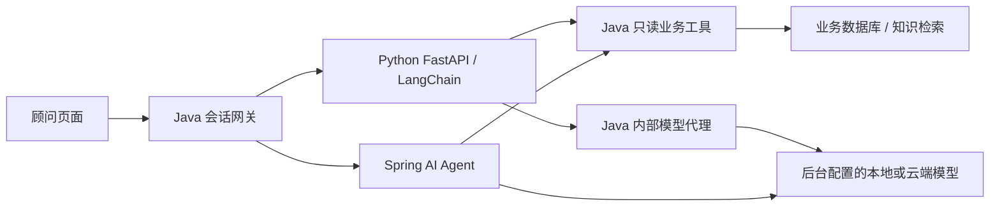

# Spring AI / LangChain 双引擎顾问

在 `/advisor` 顶部选择 Spring AI 或 LangChain。切换引擎开始新对话，历史列表标明引擎；打开历史会话自动选回其原引擎。已有会话不能改引擎，也不会在故障时静默转交另一套引擎。采购需求、商品卡片、查询依据和原文引用使用相同页面。

## 独立编排与共享边界



Python 的 `app.py` 使用 LangChain `init_chat_model`、`StructuredTool`、消息类型与 `Document`。它自己构造历史窗口、执行“模型 → 工具 → 模型”循环，将共享检索返回的原文转换为文档并构造 RAG 上下文。它不调用 Spring AI 的回答接口，也不直连数据库。

Java 在一轮开始时从管理员配置或 `.env` 读取不可变模型快照。Python 只得到限时委托凭证和安全模型名，模型代理将上游地址、Key、模型名与输出限制固定为该快照，不接受任意地址。云端与 Ollama 均经同一 OpenAI 兼容代理。

业务工具定义来自同一份 Java 注册表，不维护第二套 SQL 或企业过滤。Java 根据当前问题控制合同正文工具是否开放。商品卡片、引用和工具轨迹由实际 Java 查询归集并落库，不接受 Python 声称查询到的卡片或引用。历史原文是查询时的快照，续问价格和余量仍应重新查询。

## 委托与执行限制

每轮生成随机 runId，用本实例临时 RSA 密钥签发 10 分钟凭证。执行凭证的受众为 `langchain-engine`，回调凭证的受众为 `advisor-tools-model`；两者都绑定用户、企业、会话、用途与期限。Python 从固定 Java 地址读取公钥，校验执行与回调范围一致，执行凭证只能兑付一次。普通登录 JWT 无法用于内部工具或模型代理。

Java 每次回调重新读取账号/企业有效状态、权限和会话归属；身份、权限改变、删除会话、取消、到期、运行结束均拒绝后续访问。回调在恢复当前用户安全上下文后执行原工具，结束时清空线程记录并恢复上下文。内部请求在 JSON 解析前验证委托并限制为 64 KiB，模型请求最多 48 条消息，不允许流式请求或未注册工具。

每轮最多 6 次模型调用、10 次工具查询，累计已报告 Token 达到 65,536 后不再发起新调用；单次输出最多为后台配置与 8,192 的较小值。未提供 Token 用量时保持 null，仍受调用次数、输出和时间限制。这是运行预算，不是精确费用报价。窗口最多最近 20 条消息、10,000 字符；Qwen 的历史由 Java 进一步收窄为 2,500 字符。

“停止本轮”先在 Java 撤销委托，再通知 Python 取消异步任务。Python 不可达时仍拒绝后续回调和迟到结果。已经发往上游的请求可能仍由提供商计费，停止不能承诺撤销已发生的费用。失败与取消不保存半条问答。运行状态驻留单个 Java/Python 实例；重启撤销在途运行，当前未实现多副本共享注册表和断点恢复。

## 启动与检查

`start.cmd -Build -NoPause` 构建并启动 `advisor-langchain`。Python 只在内部 Docker 网络监听 8090，无宿主机映射端口、无数据库环境变量、无长期模型 Key。Java 不以 Python 健康状态作为启动前置条件；即使它不可达，商城与 Spring AI 仍可用。状态接口分别报告服务 ready 和模型 available，健康检查本身不发付费模型请求。

```powershell
# Python 锁定依赖与单元测试，全程在容器执行
docker compose -p spotlink-next-tools --project-directory . -f ops/compose.tools.yml run --rm --no-deps langchain-tools run --frozen pytest -q

# 同一固定模型协议、同一隔离 minimal 数据包、10 条业务基线
powershell -NoProfile -ExecutionPolicy Bypass -File scripts/tests/advisor-baseline.tests.ps1 -Engine langchain
powershell -NoProfile -ExecutionPolicy Bypass -File scripts/tests/advisor-baseline.tests.ps1 -Engine spring-ai
```

隔离基线不读取日常模型 Key，报告只写 `.local/evals`。固定替身验证取数、记忆、隔离和持久化，不能证明真实模型理解与回答质量。真实模型仍需管理员配置支持工具调用的模型后显式验证。依赖由 `pyproject.toml` 与 `uv.lock` 固定；镜像以非 root 用户和只读文件系统运行。

当前尚未提供个人模型配置、完整同条件质量/成本评测、流式回答与断线续跑。已实现的第二引擎不代表实施计划全部节点完成。
